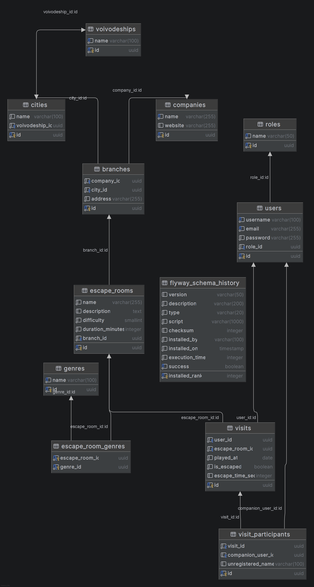

# Escape Room Tracker

Backend REST API for tracking escape room visits, built with Java 25 and Spring Boot 4.

## Tech Stack

- Java 25
- Spring Boot 4.0.3
- PostgreSQL 16
- Spring Security + JWT
- Flyway
- Testcontainers
- Docker

## Features

- User registration and login with JWT authentication
- Role-based authorization (ROLE_USER, ROLE_MODERATOR, ROLE_ADMIN)
- Escape room management with filtering and pagination
- Visit tracking with participants (registered and unregistered)
- Statistics: escape rate, average time, visits by genre and difficulty
- Company and branch management with voivodeship/city hierarchy

## Getting Started

### Prerequisites
- Docker Desktop

### Run with Docker Compose
```bash
git clone https://github.com/ArkadiuszSzczesny/escape-room-tracker.git
cd escape-room-tracker
./mvnw clean package -DskipTests
docker-compose up --build
```

API available at: `http://localhost:8080`
Swagger UI: `http://localhost:8080/swagger-ui.html`

## API Endpoints

### Auth
```
POST /api/auth/register
POST /api/auth/login
```

### Escape Rooms
```
GET    /api/rooms
GET    /api/rooms/{id}
GET    /api/rooms/by-city/{cityId}
GET    /api/rooms/by-difficulty/{difficulty}
GET    /api/rooms/by-genre/{genreName}
POST   /api/rooms    (MODERATOR, ADMIN)
DELETE /api/rooms/{id}    (ADMIN)
```

### Visits
```
POST   /api/visits
GET    /api/visits/my
GET    /api/visits/{id}
DELETE /api/visits/{id}
```

### Statistics
```
GET /api/stats/me
GET /api/stats/rooms/{roomId}
```

### Companies & Branches
```
GET/POST   /api/companies
GET/POST   /api/branches
```

### Location
```
GET /api/voivodeships
GET /api/cities
```

## Running Tests
```bash
./mvnw test
```

Tests use Testcontainers — Docker Desktop must be running.

## Database Schema




Key entities:
- **User** — registered users with roles
- **EscapeRoom** — rooms with difficulty, duration, genres
- **Branch** — company locations in cities
- **Visit** — user visits with escape time and participants